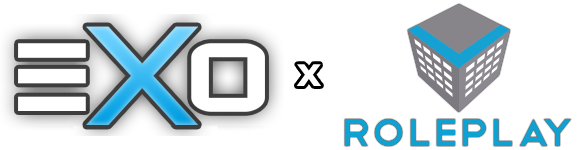

# vRoleplay

[](https://github.com/eXo-OpenSource/mta-gamemode/actions/workflows/build-docker.yml)
[](https://github.com/eXo-OpenSource/mta-gamemode/releases)
[](https://github.com/eXo-OpenSource/mta-gamemode/blob/master/docs/README_DE.md)


<p align="center">
    
</p>

<p align="center">
vRoleplay is a real-life/roleplay game mode for <a href="https://multitheftauto.com/">Multi Theft Auto: San Andreas</a>, written in Lua.
</p>

### Features:
- Factions
    - Government Factions (Police Department, FBI, Army)
        - Weapon and money trucks
        - Maintaining order on the streets
        - Prosecution of criminals
    - Rescue Team
        - Firefighting
        - Rescueing of injured players
    - Various Mafias and Gangs
        - Gangwars
        - Bankrobberies
        - Weapon and drug trucks
        - Airdrops
    
- Companies
    - Driving School
        - Issueing of driving licences to players
    - San News
        - Communication of news to players
    - Mech and Tow
        - Towing of illegally parked and broken down cars
    - Public Transport
        - Transportation of players and delivering new cars to dealerships

- Private Companies/Gangs
    - Vehicle sales/rental
    - Store robberies

- Activities
    - Fishing
    - Casino
    - Car tuning
    - Jobs
    - Sewers with secret casino and arms dealer
    - Movie Theater
    - Minigames
    - Seasonal events (Easter, Halloween, Christmas, New Year)

- Achievements

- Houses/Apartments/Garages

- Inventory

- Self-treatment of wounds

- Donation system

- Extensive UI including mobile phone with various apps

- Server Management
    - Extensive administration features
    - Integrated map editor
    - Modding control
    - Integration with Woltlab forums and control panel

- And much more!

## Installation

### Docker (recommended)
1. Install Docker

2. Download `docker-compose.yml` and edit if necessary

3. Command to start containers: 
    ```
    docker compose up -d
    ```

### Manual
1. Download vRoleplay

2. Download MariaDB Server and create a database for vRoleplay
    
2. Navigate to the resources folder and run:

    Windows:
    ```
    mklink /J [vrp] "Path to vRoleplay folder (not vrp)"
    ```

    Linux/macOS:
    ```
    ln -s 'Path to vRoleplay folder (not vrp)' '[vrp]'
    ```

    This will create a symlink to the resource folder

3. Copy the configuration template `config.ini.example` in `vrp/server/config/` to `config.ini` and fill in the necessary settings

### Admin privileges
After creating an ingame account, navigate to your database and search for your account in the `vrp_account` table. Change the `Rank` column to __9__ (Project Lead) to get admin privileges.